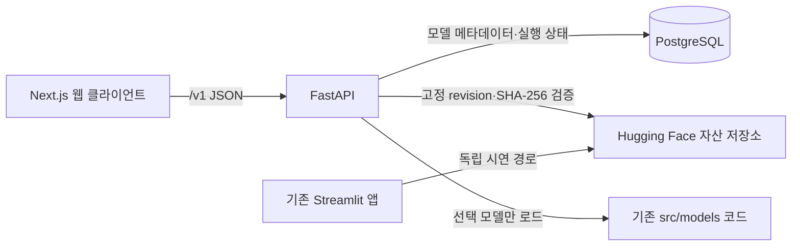

# 확장 아키텍처 (Draft)

기준: [PRD §26](prd.md), [현재 API 계약](api.md), [데이터 모델](data-model.md). 아래는 현재 공개 배포된 구현의 구조다. 운영 안정성 게이트와 Streamlit 종료 조건은 [이관 완료 기준](migration-parity.md)을 따른다.

## 서비스 경계

- `app.py` Streamlit 라이브 앱은 단계 C의 핵심 흐름 검증 후에도 유지한다. FastAPI는 `app.py`를 import하지 않고 기존 `src/models`, 전처리·평가 코드를 재사용한다.
- `backend/`는 FastAPI 요청 검증·서비스·레지스트리·DB 접근을 담당한다. `frontend/`는 Next.js·TypeScript 화면과 API 호출만 담당하며 모델 가중치와 DB 접속 정보를 갖지 않는다.
- 모델 아티팩트는 PostgreSQL에 넣지 않는다. 자산 저장소 revision과 파일별 SHA-256을 레지스트리에 기록하고 내려받은 파일을 검증한다. 현재 배포 자산 저장소는 `Ketose333/review-sentiment-assets`다.
- 기존 LSTM·KLUE-BERT 모듈은 import 시 무거운 프레임워크를 로드한다. API는 선택된 모델의 모듈만 지연 import하고, 전처리·추론·LIME은 API 프로세스가 아닌 워커 프로세스에서 실행해 기한이 지나면 종료한다. 모델 캐시도 워커 프로세스에 둔다. 워커 슬롯 수(`ANALYSIS_WORKER_SLOTS`)는 워커마다 JVM·모델 사본이 생기므로 메모리와 지연 시간을 측정해 정한다. API 의존성에는 TensorFlow·PyTorch가 없다.

## 한 건 분석

1. 클라이언트는 기본 분석에 `text`와 `modelId`만 전송한다. 세 모델 중 설명을 요청할 때 `includeExplanation`을 추가한다. 브라우저 저장소·분석 도구에 입력 원문을 남기지 않는다.
2. API는 JSON·허용 모델·500자 상한을 검증한다. 요청 본문 로깅과 오류 추적의 본문 수집을 끈다.
3. DB에 `RECEIVED` 실행을 기록하고, 선택 모델을 로드해 동기 추론한다. 상태 전환과 예측 결과를 저장한 뒤 응답한다.
4. 결과 조회는 분석 ID로 한 건만 읽는다. 24시간 만료 시 삭제 작업 전에도 404를 반환한다. 결과 응답은 `Cache-Control: no-store`를 사용한다.

구조화 로그에는 요청 ID·상태·모델 ID·지연 시간·오류 코드만 허용한다. 텍스트·해시·설명 단어·예외의 입력값 표현은 로그와 추적 이벤트에서 제외한다. SQL은 매개변수 바인딩을 사용하고 CORS는 설정된 웹 출처만 허용한다. 인증 없는 공개 데모이므로 비용이 큰 분석 요청의 속도 제한은 공개 배포 전에 설정·검증한다.

## 단계와 배포

- A: API·저장 계약, FastAPI 골격, 레지스트리와 마이그레이션, 모델 목록·입력 검증 테스트.
- B: 한 모델의 동기 분석과 상태 저장, 오류 경로. 기존 모델 성능 수치를 다시 학습하거나 바꾸는 작업은 포함하지 않는다.
- C: Next.js 화면과 모델 성능 비교. 서로 다른 평가 표본이라는 조건을 화면에 명시한다.
- D: LIME 제공 범위와 지연 시간, 로그·만료 삭제·배포 재현 점검.

하드 타임아웃과 다중 프로세스 공통 속도 제한(PostgreSQL 고정 창 카운터)은 구현·검증했다. 공개 호스팅 형태는 [공개 배포 계획](deployment-public.md)에서 웹 Vercel·API 컨테이너 호스팅·무료 관리형 PostgreSQL로 확정했다. 콜드 스타트는 워커 최초 기동 약 9~11초다. 로컬에서는 API·웹·PostgreSQL을 각각 실행하고 Docker Compose는 재현이 필요할 때만 추가한다. 초기 요청은 동기 HTTP이며 Redis·메시지 큐·Kafka·Kubernetes는 도입하지 않는다.
