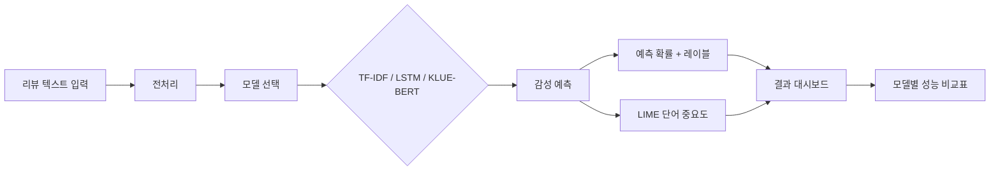
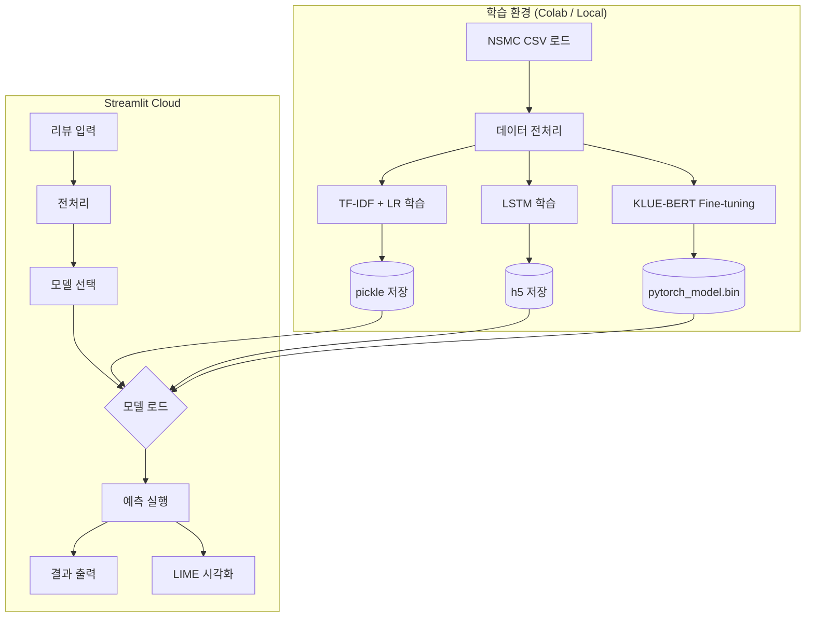
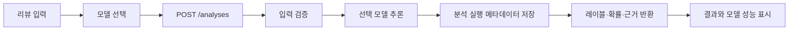
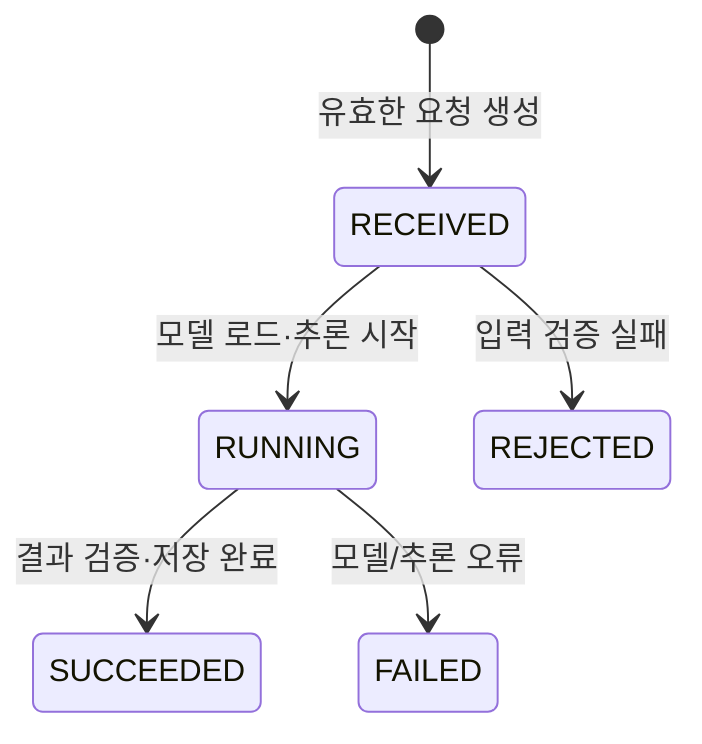

# review-sentiment PRD

## 0. 문서 메타데이터

| 항목 | 값 |
| --- | --- |
| 상태 | MVP·확장 구현 완료 · 공개 운영 검증 중 |
| 마지막 업데이트 | 2026-09-25 |
| 목표 릴리즈 또는 마일스톤 | Streamlit MVP 완료 · 다음 마일스톤은 §26 참조 |

### 변경 이력

| 날짜 | 변경 | 이유 |
| --- | --- | --- |
| 2026-06-18 | 최초 초안 | |
| 2026-06-19 | 트랜스포머 모델을 KLUE-BERT(`klue/bert-base`)로 확정 | SKT KoBERT는 커스텀 토크나이저·버전 호환성 이슈로 구현 리스크가 높고, KLUE-BERT는 표준 경로로 동급 이상 성능(NSMC) 확보 가능 (§2.1 참고) |
| 2026-06-21 | 모델 저장 포맷·로드 경로 명문화 | transformers 5.x `model.safetensors` 기본 포맷 대응 |
| 2026-09-23 | Streamlit MVP 이후의 API·저장·웹 분리 확장 범위 추가 | 기존 모델 비교 프로젝트를 유지하면서 Python 백엔드·PostgreSQL·현대 웹 클라이언트 경험을 단계적으로 보강하기 위함 |
| 2026-09-25 | FastAPI·PostgreSQL·Next.js 구현과 공개 배포 기록 | 공개 기능 검증은 통과했으며 장기 안정성·무료 한도 점검과 Streamlit 전환은 계속한다. |

## 1. 문서 목적

이 PRD는 review-sentiment 프로젝트의 제품 요구사항과 의사결정 기준을 정의한다.

- **다루는 범위**: NSMC 데이터 기반 감성 분류 모델 개발, Streamlit 데모 앱, 모델 비교 평가, LIME 기반 예측 근거 시각화.
- **다루지 않는 범위**: 실시간 수집 파이프라인, 사용자 계정/인증, 모델 재학습 자동화, 모바일 앱, 장르 레이블 수집(NSMC에 장르 정보 없음).
- **이 문서로 내릴 결정**: 데이터셋 선정, 모델 후보와 평가 기준, MVP 시연 범위, 토크나이저 선택, 모델 해석 도구 선택.

## 2. 프로젝트 개요

NSMC(Naver Sentiment Movie Corpus) 20만 건의 영화 리뷰로 긍/부정 감성 분류 모델을 학습하고, Streamlit 대시보드에서 사용자 입력 리뷰의 감성을 예측하며 LIME으로 예측 근거 단어를 시각화하는 ML 프로젝트다. TF-IDF + LogisticRegression, LSTM, KLUE-BERT 3개 모델을 비교하여 성능 차이를 수치로 보여준다.

| 항목 | 값 |
| --- | --- |
| 스택 | Python 3.11 · scikit-learn · TensorFlow/Keras · Transformers · Streamlit |
| 데이터 | NSMC(`e9t/nsmc` 원본) — 200,000 reviews, 평점에서 유도한 긍/부정 레이블 |
| 배포 | Streamlit Cloud (share.streamlit.io) |
| 모델 해석 | LIME (LimeTextExplainer) |

### 2.1 후보에서 승계한 결정

| 구분 | 내용 | 근거 |
| --- | --- | --- |
| 유지할 결정 | NSMC 데이터셋 사용 | `e9t/nsmc` 원본의 학습·테스트 파일을 내려받아 사용 |
| 유지할 결정 | Streamlit Cloud 배포 | 무료, 빠른 프로토타이핑 |
| 유지할 결정 | 3개 모델(TF-IDF/LSTM/KLUE-BERT) 비교 | 다양한 ML 스펙트럼 커버 |
| 다시 검증할 가정 | KLUE-BERT를 로컬에서 학습 가능한가 | Colab 또는 CPU fallback 확인 필요 |

### 2.1.1 트랜스포머 모델 결정 근거 (2026-06-19)

3개 모델 비교의 트랜스포머 슬롯은 **KLUE-BERT(`klue/bert-base`)**로 확정한다. SKT KoBERT(`skt/kobert-base-v1`)는 채택하지 않는다.

| 기준 | SKT KoBERT (`skt/kobert-base-v1`) | KLUE-BERT (`klue/bert-base`, 채택) |
| --- | --- | --- |
| 이 프로젝트의 구현 | 직접 학습·평가하지 않음 | `AutoTokenizer`·`AutoModelForSequenceClassification` 경로로 학습·평가 |
| 이 프로젝트의 NSMC 결과 | 없음 | CPU 표본(train 1.8만/test 5천) Accuracy 0.878. 전체 테스트 분할 평가는 아직 없음 |
| 출처 | 후보 모델 | [KLUE 모델 카드](https://huggingface.co/klue/bert-base)·[Park et al. (2021)](https://arxiv.org/abs/2105.09680) |

채택 근거는 이 프로젝트에서 구현한 경로와 관측한 결과다. 서로 다른 공개 실험의 정확도를 직접 비교한 근거로 사용하지 않는다. 평가·출처 점검은 `docs/model-audit.md`를 따른다.

## 3. 프로젝트 목표

### 3.1 문제 정의

- **사용자가 원하는 결과**: 한국어 영화 리뷰 텍스트를 입력하면 긍/부정 감성을 정확히 예측하고, 예측 근거를 이해할 수 있어야 한다.
- **그 결과를 원하는 이유**: 동일한 감성 분류 문제를 고전적 ML → 딥러닝 → 사전학습 언어모델 3단계로 풀어보고 성능·해석가능성 트레이드오프를 비교하기 위해.
- **현재 상태의 한계**: 텍스트 감정 분석 모델, 추천 알고리즘, 모델 평가 및 배포 경험이 필요함.
- **근거 출처 또는 확신 수준**: High — NSMC는 한국어 NLP 벤치마크 데이터로 검증된 데이터셋.

## 4. 목차

문서 메타데이터 · 문서 목적 · 프로젝트 개요 · 프로젝트 목표 · 타깃 사용자 · 대안과 차별점 · 핵심 가치 제안 · MVP 범위 · 사용자 흐름 · 상호작용 인터페이스 요구사항 · 제품 또는 시스템 요구사항 · 인수 조건 · 비기능 요구사항 · 엣지 케이스와 에러 처리 · 아키텍처 개요 · 프로토타입 범위 · 데이터 요구사항 · 개인정보와 보안 요구사항 · 성공 지표 · 우선순위 · 가정과 검증 · 주요 리스크 · 회고 · 열린 질문 · 참고 자료

## 5. 타깃 사용자

### 5.1 주요 사용자

- 포트폴리오 방문자 및 오픈소스 기여자.
- NLP/ML에 관심이 있는 개발자 및 리뷰어.

### 5.2 초기 집중 사용자

- Streamlit 링크로 직접 리뷰를 입력해보는 방문자.

### 5.3 비타깃 사용자

- 실시간 서비스가 필요한 일반 대중. 이 프로젝트는 ML 모델 비교와 시각화에 중점을 둔다.

### 5.4 사용자 문제

- 한국어 텍스트 감성 분류 모델을 엔드투엔드로 구현하고 비교한 경험이 부족하다.
- 모델 예측 결과를 "왜 그렇게 예측했는지" 시각적으로 설명할 방법이 필요하다.

## 6. 대안과 차별점

| 대안 | 한계 | review-sentiment의 차이 |
| --- | --- | --- |
| Kaggle Notebook 제출 | 외부에서 접근 불가, 인터랙션 부족 | Streamlit으로 누구나 리뷰 입력 가능 |
| 단일 모델만 구현 | 모델 선정 근거 부족 | TF-IDF/LSTM/KLUE-BERT 3종 비교 + 성능표 |
| 예측 결과만 출력 | 블랙박스 | LIME으로 근거 단어 하이라이트 |

차별 포인트: **3개 모델 비교 + 예측 근거 시각화**.

## 7. 핵심 가치 제안

한국어 영화 리뷰 한 줄을 입력하면 "이 리뷰는 92% 확률로 긍정입니다"라는 예측과 함께 예측에 가장 큰 영향을 준 단어 5개를 LIME으로 시각적으로 보여준다. TF-IDF → LSTM → KLUE-BERT로 갈수록 성능이 어떻게 달라지는지 한 화면에서 비교할 수 있다.

## 8. MVP 범위

| 포함 범위 | 제외 범위 | 이유 |
| --- | --- | --- |
| NSMC 데이터 전처리 및 EDA | 실시간 크롤링 | 과도한 범위, 데이터 안정성 확보 |
| TF-IDF + LogisticRegression 모델 | 앙상블 모델 | 3종 비교로 충분 |
| LSTM 모델 | Transformer 단독 | KLUE-BERT가 트랜스포머 기반으로 커버 |
| KLUE-BERT 모델 | LoRA/fine-tuning 가속 | 풀 파인튜닝으로 충분 |
| LIME 시각화 | Grad-CAM 등 다른 해석 기법 | LIME 1개로 충분, KLUE-BERT에도 적용 가능 |
| Streamlit 단일 페이지 | 다중 페이지 대시보드 | MVP 단순성 유지 |
| 긍/부정 이진 분류 | 다중 감정 분류(기쁨/슬픔 등) | NSMC는 이진 레이블 |

### 8.1 포함

1. NSMC 데이터 로드 및 전처리 (Okt 형태소 분석, 불용어 제거, 패딩)
2. EDA: 리뷰 길이 분포, 워드클라우드, 레이블 분포
3. TF-IDF + LogisticRegression 학습 및 평가
4. LSTM (Embedding + LSTM + Dense) 학습 및 평가
5. KLUE-BERT fine-tuning 및 평가
6. 모델 성능 비교표 (Accuracy, Precision, Recall, F1)
7. LIME(LimeTextExplainer)을 활용한 예측 근거 단어 시각화
8. Streamlit 앱: 리뷰 입력 → 모델 선택 → 예측 결과 + 근거 단어 출력

### 8.2 제외

1. 사용자 계정/로그인
2. 리뷰 데이터 수집 자동화
3. 모델 재학습/자동 업데이트
4. 다국어 지원
5. 모바일 앱
6. 실시간 추천 시스템
7. 다중 감정 레이블 분류

## 9. 사용자 흐름



1. 사용자가 Streamlit 페이지에 접속한다.
2. 텍스트 영역에 영화 리뷰를 입력한다.
3. 분석할 모델(TF-IDF / LSTM / KLUE-BERT / 모두 비교)을 선택한다.
4. 시스템이 입력 텍스트를 전처리하고 선택한 모델로 예측한다.
5. 예측 결과(긍정/부정, 확률)를 출력한다.
6. 예측에 가장 큰 영향을 준 단어 TOP 5~10을 하이라이트하여 표시한다.
7. 하단에 3개 모델의 성능 비교표를 확인할 수 있다.

## 10. 상호작용 인터페이스 요구사항

### 10.1 Streamlit 웹 인터페이스

| 요소 | 설명 |
| --- | --- |
| 리뷰 입력 | `st.text_area` — 1~3문장 영화 리뷰 |
| 모델 선택 | `st.radio` 또는 `st.selectbox` — TF-IDF / LSTM / KLUE-BERT / 모두 |
| 예측 결과 | `st.metric` — 긍정/부정 레이블 + 신뢰도 확률 |
| 근거 단어 | `st.bar_chart` 또는 커스텀 시각화 — 단어별 기여도 |
| 성능 비교표 | `st.dataframe` — 모델별 Accuracy/Precision/Recall/F1 |

## 11. 제품 또는 시스템 요구사항

| 요구사항 ID | 요구사항 | 사용자 이야기 또는 시나리오 | 우선순위 | 비고 |
| --- | --- | --- | --- | --- |
| PR-001 | NSMC 데이터를 로드하고 학습/테스트 세트를 분리한다. | "데이터를 8:2로 나눠 학습한다" | P0 | |
| PR-002 | 한국어 형태소 분석으로 텍스트를 전처리한다. | "OKT 또는 Mecab으로 토크나이징한다" | P0 | |
| PR-003 | TF-IDF + LogisticRegression 모델을 학습하고 저장한다. | "pickle로 모델 저장, Streamlit에서 로드" | P0 | |
| PR-004 | LSTM 모델을 학습하고 `.h5`로 저장한다. | "Embedding → LSTM → Dense 구조" | P0 | |
| PR-005 | KLUE-BERT를 fine-tuning하고 저장한다. | "transformers 라이브러리 활용" | P0 | GPU 권장. 현재 결과는 CPU 서브셋 학습 기준이며, 전체 데이터 재학습은 별도 개선 항목이다. |
| PR-006 | 각 모델의 Accuracy/Precision/Recall/F1을 계산한다. | "classification_report로 출력" | P0 | |
| PR-007 | Streamlit 앱에서 모델을 로드하고 예측을 수행한다. | "pickle/h5/torch로 로드 → predict" | P0 | |
| PR-008 | LIME으로 예측 근거 단어를 시각화한다. | "LimeTextExplainer로 예측에 기여한 단어 TOP 5 표시" | P1 | |
| PR-009 | 3개 모델 성능을 하나의 비교표로 보여준다. | "st.dataframe으로 출력" | P1 | |
| PR-010 | EDA 결과(워드클라우드, 길이 분포 등)를 앱에 포함한다. | "데이터 탐색 결과 시각화" | P2 | |

## 12. 인수 조건

### PR-003: TF-IDF + LogisticRegression

```text
Given NSMC 학습 데이터
When TF-IDF 벡터라이저를 fit하고 LogisticRegression을 학습시킨 후
Then 테스트 Accuracy가 0.80 이상이어야 한다
```

### PR-004: LSTM

```text
Given 전처리된 NSMC 학습 데이터
When Embedding → LSTM → Dense 구조로 학습시킨 후
Then 테스트 Accuracy가 0.85 이상이어야 한다
```

### PR-005: KLUE-BERT

```text
Given NSMC 학습 데이터
When KLUE-BERT를 fine-tuning한 후
Then 테스트 Accuracy가 0.88 이상이어야 한다
```

현재 저장 지표는 LSTM 0.8238, KLUE-BERT 0.8780으로 각 목표에 미달한다. KLUE-BERT는 테스트 분할 5천 건 표본 평가라 전체 테스트 기준도 확인되지 않았다. 이 조건은 과거 목표로 유지하고, §26 확장의 구현 완료 조건과는 분리한다. 공통 평가·재학습 판단은 `docs/model-audit.md`를 따른다.

### PR-007: Streamlit 예측

```text
Given Streamlit 앱이 실행 중인 상태
When 사용자가 "정말 재미있는 영화였어요"를 입력하고 예측 버튼을 누르면
Then "긍정" 레이블과 0.8 이상의 확률이 출력되어야 한다
```

## 13. 비기능 요구사항

| 범주 | 요구사항 | 측정 기준 또는 표준 | 우선순위 |
| --- | --- | --- | --- |
| 성능 | TF-IDF 모델 예측이 1초 이내에 완료되어야 함 | `time` 측정 | P0 |
| 성능 | KLUE-BERT 모델 예측이 5초 이내에 완료되어야 함 | `time` 측정 | P1 |
| 신뢰성 | 동일 입력에 대해 동일 예측 결과를 반환해야 함 | 시드 고정 | P1 |
| 저장 | 모델 파일 크기가 Streamlit Cloud 무료 티어 제한을 초과하지 않아야 함 | GitHub 100MB | P1 |

## 14. 엣지 케이스와 에러 처리

| 상황 | 기대 동작 | 사용자 메시지 또는 복구 방법 | 우선순위 |
| --- | --- | --- | --- |
| 빈 리뷰 입력 | 예측 실행 차단 | "리뷰 텍스트를 입력해주세요." | P0 |
| 너무 짧은 리뷰(1~2글자) | 예측은 수행하나 신뢰도 낮음 표시 | "입력이 짧아 예측 신뢰도가 낮을 수 있습니다." | P1 |
| 모델 파일 로드 실패 | fallback 메시지와 함께 다른 모델 사용 유도 | "KLUE-BERT 모델을 불러올 수 없습니다. TF-IDF 모델을 사용해보세요." | P0 |
| Streamlit Cloud 메모리 부족 | KLUE-BERT 모델 로드 생략 | "KLUE-BERT는 로컬 또는 Colab에서만 지원됩니다." | P1 |
| 특수문자/이모지만 입력 | 전처리 후 빈 텍스트 처리 | "분석 가능한 텍스트가 없습니다. 한글 리뷰를 입력해주세요." | P1 |

## 15. 아키텍처 개요



## 16. 프로토타입 범위

프로토타입은 다음을 증명해야 한다:

- 서로 다른 복잡도의 모델(TF-IDF → LSTM → KLUE-BERT) 간 성능 차이를 수치로 비교 가능하다.
- 모델 예측 결과를 단어 단위로 해석하여 사용자에게 설명할 수 있다.
- Streamlit Cloud에서 모델 파일을 로드하고 실시간 예측이 동작한다.

프로토타입에서 시도하지 않을 것:

- 사용자 세션 관리, 데이터 영속성, A/B 테스트.

## 17. 데이터 요구사항

### 17.1 NSMC (Naver Sentiment Movie Corpus)

| 항목 | 값 |
| --- | --- |
| 출처 | https://github.com/e9t/nsmc — `ratings_train.txt` / `ratings_test.txt` |
| 크기 | 200,000개 리뷰 (train 150,000 / test 50,000) |
| 포맷 | Tab-separated `.txt` (id / document / label) |
| 레이블 | 0 (부정), 1 (긍정) |
| 라이선스 | 원본 저장소에 명시되지 않음. Hugging Face 복제본의 표기와 차이가 있어 재배포 조건 확인 필요 |
| 확인 | 2026-06-18 접속 확인, raw 파일 정상 응답 |

### 17.2 전처리 결과물

| 항목 | 형식 | 비고 |
| --- | --- | --- |
| TF-IDF 벡터라이저 | `.pkl` | vocab size 10,000 |
| TF-IDF + LR 모델 | `.pkl` | |
| LSTM 토크나이저 | `.pkl` | |
| LSTM 모델 | `.h5` | vocab size 20,000, embedding 100, lstm 128 |
| KLUE-BERT 모델 | `model.safetensors` (442MB, transformers 5.x 기본) | klue/bert-base, CPU 서브셋 fine-tune |

## 18. 개인정보와 보안 요구사항

- NSMC는 공개 데이터셋으로 개인정보를 포함하지 않는다.
- Streamlit 앱에서 입력받는 리뷰 텍스트는 서버에 저장되지 않는다 (세션 휘발).
- 모델 파일은 GitHub LFS 또는 Git Annex로 관리하며, `.gitignore`로 대용량 파일의 일반 커밋을 방지한다.
- API 키, 토큰 등 민감 정보는 `.env` 또는 `st.secrets`로 관리한다.

## 19. 성공 지표

| 지표 | 목표 | 측정 방법 |
| --- | --- | --- |
| KLUE-BERT 테스트 Accuracy | 0.88 이상 | `sklearn.metrics.accuracy_score` |
| TF-IDF vs LSTM vs KLUE-BERT 성능 차이 | 단계적 향상 확인 가능 | 비교표 출력 |
| Streamlit 예측 응답 시간 | 5초 이내 | 실측 |

## 20. 우선순위

### P0

반드시 출시: NSMC 데이터 전처리, TF-IDF + LogisticRegression, Streamlit 기본 앱, 예측 결과 출력, 모델 성능 비교표.

### P1

다음으로 중요: LSTM 모델, KLUE-BERT 모델, LIME 시각화.

### P2

유용한 개선: EDA 시각화 포함, 워드클라우드, 다양한 예시 리뷰 프리셋.

### Future

장기 확장: 다중 감정 분류(7-class), 실시간 리뷰 크롤링, 추천 시스템 연동.

## 21. 가정과 검증

| 가정 | 근거 수준 | 틀렸을 때의 위험 | 검증 계획 |
| --- | --- | --- | --- |
| KLUE-BERT를 Google Colab에서 fine-tuning 가능 | High (표준 transformers 경로) | Colab GPU 메모리 부족 시 CPU fallback 또는 LSTM만 데모 | Colab GPU 확인 후 대체 계획 수립 |
| Streamlit Cloud 무료 티어로 모델 3개 로드 가능 | Medium | 메모리 초과로 KLUE-BERT 로드 실패 가능 | 모델 경량화 또는 조건부 로드 구현 |
| 발표 청중이 모델 비교표를 이해 | High | 표가 너무 복잡하면 전달력 하락 | 시각적 계층 구성으로 가독성 확보 |

## 22. 주요 리스크

| 리스크 | 영향 | 확률 | 대응 |
| --- | --- | --- | --- |
| KLUE-BERT 학습에 GPU 시간 부족 | KLUE-BERT 누락, 2개 모델만 비교 | 중 | CPU 경량 모델 fallback |
| 모델 파일이 GitHub 100MB 초과 | GitHub 직접 배포 실패 | 해결됨 | 가중치는 Hugging Face Hub 자산 저장소에서 런타임 로드 |
| Streamlit Cloud에서 KLUE-BERT OOM | 모델 3개 동시 로드 불가 | 중 | 조건부 로드: 사용자가 선택한 모델만 HuggingFace Hub에서 로드, `st.cache_resource`로 캐싱 |
| 배포 환경 네트워크 장애 | 시연 불가 | 저 | 로컬 Streamlit fallback |

## 23. 회고

(프로젝트 완료 후 작성)

## 24. 열린 질문

1. KLUE-BERT를 CPU-only 환경에서 어느 정도까지 최적화할 수 있을까? → ONNX 변환 또는 양자화 검토 필요.
2. Streamlit Cloud에서 Hugging Face Hub 모델 다운로드 시간이 수용 가능한가? → 첫 로드 시 1~2분, 이후 `st.cache_resource`로 즉시 제공 예정.

## 25. 참고 자료

- NSMC GitHub 저장소: https://github.com/e9t/nsmc (raw 파일 정상, 2026-06-18 확인)
- KLUE-BERT Hugging Face: https://huggingface.co/klue/bert-base (채택 모델, 표준 `AutoTokenizer` 경로)
- KLUE Benchmark 논문 (Park et al., 2021): https://arxiv.org/abs/2105.09680
- 한국어 PLM 비교 서베이: https://arxiv.org/pdf/2112.03014
- LIME: https://github.com/marcotcr/lime
- konlpy (Okt 토크나이저): https://github.com/konlpy/konlpy
- Streamlit: https://streamlit.io

---

## 26. 확장 마일스톤 — 분석 API와 검토 웹 분리 (Draft)

### 26.1 배경과 결정

현재 Streamlit MVP는 한 화면에서 모델을 비교하고 예측 근거를 보여 주는 목적을 달성했다. 그러나 요청 검증, 모델 가용성 오류, 분석 실행 이력, 모델 메타데이터를 화면 코드와 분리해 다루지는 않는다.

이 확장은 기존 NSMC·3개 모델·LIME 결과를 바꾸거나 재학습하는 작업이 아니다. **한 번의 감성 분석을 API 계약과 상태로 다루고, 웹 클라이언트가 그 결과를 조회하는 구조**를 추가하는 마일스톤이다.

| 구분 | 이번 문서에서 확정한 내용 | 근거 |
| --- | --- | --- |
| 사용자 가치 | 방문자는 한 리뷰를 선택한 모델로 분석하고, 결과·모델 정보·오류 상태를 일관되게 확인한다. | 기존 Streamlit 예측 경험을 유지한다. |
| 백엔드 | Python/FastAPI가 모델 로드·입력 검증·예측을 소유한다. | 기존 추론 코드와 Python 모델 생태계를 재사용한다. |
| 웹 클라이언트 | Next.js·TypeScript가 분석 입력·결과·모델 비교 화면을 소유한다. | 현재 Streamlit 화면 책임을 분리한다. |
| 영속 데이터 | PostgreSQL은 모델 레지스트리와 분석 실행 메타데이터를 소유한다. | 모델 파일과 사용자 입력 전체를 DB에 넣지 않는다. |
| 구현 순서 | 동기 분석 API를 먼저 완성하고, 실제 측정 후에만 비동기 큐를 검토한다. | 이 프로젝트 규모에서 Redis·메시지 브로커를 선행 도입하지 않는다. |

### 26.2 사용자와 핵심 흐름

주 사용자는 포트폴리오 방문자 또는 프로젝트 운영자다. 로그인한 일반 사용자 서비스나 상용 리뷰 수집 도구를 전제로 하지 않는다.



1. 방문자가 한국어 영화 리뷰와 하나의 분석 모델을 선택한다.
2. 클라이언트는 분석 요청을 전송하고, 유효하지 않은 입력은 서버가 거부한다.
3. 서버는 선택한 모델로 예측하고, 분석 ID·모델 버전·소요 시간·결과 또는 오류 코드를 기록한다.
4. 클라이언트는 긍정/부정 결과, 확률, 제공 가능한 근거 단어와 선택 모델의 사전 계산 성능·평가 범위를 표시한다.
5. 서버 오류 또는 모델 미가용 상태는 예측 결과처럼 보이지 않게 별도 상태로 표시한다.

### 26.3 범위와 비목표

#### 이번 확장에 포함

| ID | 요구사항 | 우선순위 |
| --- | --- | :---: |
| EX-001 | 모델 목록과 각 모델의 표시명·버전·지원 여부·사전 계산 성능을 조회한다. | P0 |
| EX-002 | 하나의 리뷰와 하나의 모델을 받아 긍정/부정 예측을 수행한다. | P0 |
| EX-003 | 빈 입력, 공백 입력, 지나치게 긴 입력, 지원하지 않는 모델을 명시적으로 검증한다. | P0 |
| EX-004 | 분석 ID, 모델 식별자, 실행 상태, 소요 시간, 오류 코드를 저장한다. | P0 |
| EX-005 | 원시 리뷰 텍스트는 영속 DB와 운영 로그에 저장하지 않는다. | P0 |
| EX-006 | 분석 결과와 모델 성능 비교를 Next.js·TypeScript 화면에서 표시한다. | P1 |
| EX-007 | 설명을 요청한 경우 지원 모델의 LIME 근거 단어와 기여도를 생성 응답에 포함한다. 제공 불가하거나 생성 실패하면 그 사실을 결과에 표시한다. 설명 전문은 저장하지 않는다. | P1 |
| EX-008 | 요청 수·성공/실패·모델별 지연 시간·오류 유형을 원문 없이 관측한다. | P1 |

#### 이번 확장에서 하지 않을 것

- NestJS, Redis, Kafka, Kubernetes를 기술 이력 보강만을 목적으로 도입하지 않는다.
- 사용자 계정, 로그인, 결제, 공개 리뷰 수집·크롤링, 사용자별 장기 분석 이력을 만들지 않는다.
- NSMC 재학습, 모델 성능 개선, 모델 자동 배포·롤백, GPU 서빙을 이 마일스톤의 완료 조건으로 삼지 않는다.
- 분석 결과를 영화 평점·사용자 감정·상업적 의사결정의 사실로 단정하지 않는다.
- 한 요청에서 3개 모델을 동시에 실행하는 비교 기능은 넣지 않는다. 비교 화면은 사전 계산된 지표를 사용한다.

### 26.4 분석 실행 상태와 불변 조건

초기 릴리즈는 동기 HTTP 요청으로 처리한다. 따라서 `QUEUED` 상태와 별도 워커는 아직 만들지 않는다.



- `SUCCEEDED`, `FAILED`, `REJECTED`는 종료 상태이며 다른 상태로 바뀌지 않는다.
- JSON 형식·필드 타입 오류와 미등록 모델 ID는 실행 생성 전에 422로 거절한다. 등록 모델의 텍스트 검증 실패만 `RECEIVED → REJECTED` 실행으로 기록한다.
- 성공 결과에는 정확히 하나의 모델 식별자, 이진 레이블, 0 이상 1 이하의 확률이 있어야 한다.
- 실패·거절 실행에는 성공 예측값을 기록하지 않는다.
- 모델 성능 수치는 각 학습 결과의 메타데이터에서 읽으며, 요청별 결과를 합산해 새 성능 수치처럼 표시하지 않는다.
- 원시 리뷰 텍스트와 LIME 입력 전문은 DB·구조화 로그·오류 추적 이벤트에 넣지 않는다.

### 26.5 인터페이스 계약 초안

경로와 JSON 필드의 상세 계약은 `docs/api.md`에 둔다. 아래는 제품 계약의 최소 형태다.

| 작업 | 메서드·경로 | 성공 응답 | 실패 원칙 |
| --- | --- | --- | --- |
| 모델 목록 | `GET /v1/models` | 모델 ID, 표시명, 버전, 지원 상태, 성능 요약 | 레지스트리 불가 시 503 |
| 분석 생성 | `POST /v1/analyses` | 분석 ID, `SUCCEEDED`, 모델 ID, 레이블, 확률, 설명 가능 여부, 소요 시간 | 입력 오류 422, 모델 미가용 503, 예측 실패 500 |
| 분석 결과 조회 | `GET /v1/analyses/{analysisId}` | 이미 저장된 메타데이터와 결과 | 없는 ID 404 |

`POST /v1/analyses`의 기본 입력은 `text`와 `modelId`다. 현재 로컬 구현은 세 모델의 설명 요청에 선택적 `includeExplanation`을 사용한다. 이관 완료 목표는 [기능 동등성 기준](migration-parity.md)을 따른다. 현재 필드별 형식과 오류 응답은 `docs/api.md`에 기록한다.

### 26.6 데이터 소유와 최소 데이터 모델

| 엔터티 | 소유 데이터 | 금지 또는 주의 사항 |
| --- | --- | --- |
| `model_registry` | 모델 ID, 표시명, 아티팩트 버전/해시, 활성 여부, 성능 요약, 설명 지원 여부 | 모델 바이너리·학습 데이터는 DB에 저장하지 않는다. |
| `analysis_runs` | UUID, 모델 ID, 상태, 결과 레이블·확률, 설명 가능 여부, 지연 시간, 오류 코드, 생성/종료 시각 | 원시 리뷰 텍스트·텍스트 해시·설명 단어는 저장하지 않는다. |
| `schema_migrations` | 스키마 버전 | 기존 마이그레이션은 수정하지 않는다. |

분석 결과 조회는 분석 ID를 아는 요청에만 제공한다. 인증을 넣지 않는 초기 단계에서는 생성 후 24시간이 지나면 조회를 404로 처리하고 만료 레코드를 주기적으로 삭제한다. 운영 화면에서 임의의 분석 ID 목록을 노출하지 않는다.

### 26.7 품질·보안·운영 요구사항

- 입력 텍스트는 표시 전 이스케이프하고, 서버는 모델 선택 값을 허용 목록으로 검증한다.
- CORS는 배포된 웹 클라이언트 출처만 허용한다. 개발 환경의 허용 출처는 환경변수로 분리한다.
- 예측 요청에는 요청 ID를 부여하고, 로그에는 상태·모델 ID·지연 시간·오류 코드만 남긴다.
- 모델 로드 실패와 추론 실패를 구분하고, 사용자에게 내부 예외나 경로를 노출하지 않는다.
- 배포 전 최소 검증은 API 단위 테스트, 기존 모델 테스트, 클라이언트 빌드, 분석 성공·입력 거절·모델 미가용 경로의 통합 확인이다.
- Docker Compose는 로컬 재현과 서비스 경계 확인을 위한 선택 항목이다. 컨테이너 오케스트레이션이나 고가용성을 주장하지 않는다.

### 26.8 단계별 완료 기준

| 단계 | 완료 산출물 | 종료 기준 |
| --- | --- | --- |
| A. 계약·기반 | FastAPI 프로젝트, 모델 레지스트리, PostgreSQL 마이그레이션, API 계약, 테스트 골격 | 모델 목록과 입력 검증이 테스트로 고정된다. |
| B. 단일 분석 | 한 모델의 동기 분석 API, 실행 상태 저장, 오류 분기 | 성공·입력 거절·모델 미가용·추론 실패가 서로 다른 응답과 기록으로 확인된다. |
| C. 웹 분리 | Next.js 분석 화면과 모델 비교 화면 | 기존 Streamlit의 핵심 시연(입력·예측·모델 비교)을 웹 클라이언트에서 재현한다. |
| D. 설명·운영 점검 | 설명 결과 표기, 구조화 로그, 배포 재현 문서 | 원문 미저장과 실패 상태 표시를 확인하고 포트폴리오 사실을 갱신한다. |

Streamlit 앱은 [이관 완료 기준](migration-parity.md)의 세 모델 예측·설명, 500자 입력, 공개 주소 검증이 끝날 때까지 유지한다.

### 26.9 확정된 결정과 남은 운영 결정

| 질문 | 선택지 | 현재 상태 |
| --- | --- | --- |
| 분석 결과 보존 기간 | 즉시 삭제 / 짧은 TTL / 운영자 수동 삭제 | **24시간 확정** — 만료 후 조회 404, 만료 레코드는 최소 하루 한 번 삭제 |
| 텍스트 길이 제한 | 모델별 상한 / 공통 상한 | **공통 500자 구현** — 기존 Streamlit 입력 한도를 유지하고 공개 API의 500/501자 경계를 검증 |
| 설명 대상 모델 | TF-IDF만 / 지원 모델 전체 | **세 모델 LIME 구현** — 예측 성공과 설명 실패를 분리하고 로컬 컨테이너에서 검증. 공개 환경의 지연·실패·배포 사양 검증은 남음. `docs/lime-measurement.md` 참조 |
| 배포 형태 | API·웹 분리 배포 / Docker Compose 단일 배포 | **API·웹 분리** — Vercel Hobby 웹, Modal Starter API, Neon Free PostgreSQL로 공개 배포. 무료 한도·콜드 스타트·부하 안정성은 계속 확인한다. `docs/deployment-public.md` 참조 |
| 비동기 작업 전환 | 동기 유지 / 별도 워커·큐 도입 | 초기 버전은 동기 유지. 지연 시간·동시성 측정 결과가 있을 때만 재검토 |

### 26.10 구현 핸드오프

단계 A~D 구현·공개 배포를 완료했다. 하드 타임아웃·다중 프로세스 속도 제한, 공개 기능 동등성까지 검증했으며 장기 무료 운영과 부하 안정성은 계속 측정한다. 구현 산출물의 기준 문서는 다음과 같다.

1. `docs/api.md`: 요청·응답 JSON, 오류 형식, API 버전 정책
2. `docs/data-model.md`: 테이블·인덱스·보존/삭제 정책과 마이그레이션 순서
3. `docs/architecture.md`: 기존 Python 모델 코드 재사용 경계, FastAPI·PostgreSQL·Next.js 배포 경계
4. 구현 단계: API 계약 테스트 → FastAPI·DB → Next.js 화면 → 통합 검증 순서
